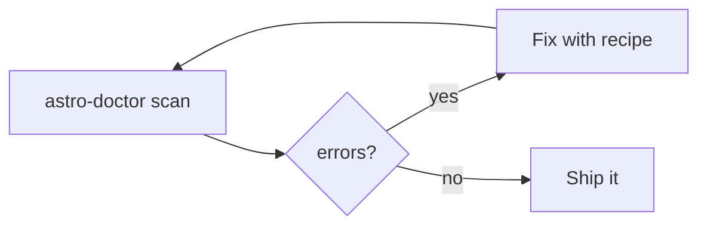

# astro-doctor

Your agent writes bad Astro. This catches it.

Deterministic static analysis for Astro: 42 rules, zero LLM, zero network. Every finding ships file, line, and a fix recipe.

<CardGroup cols={3}>
  <Card title="Quickstart" icon="rocket" href="/quickstart">
    First audit in one command.
  </Card>
  <Card title="Rules" icon="book-open" href="/rules">
    All 42 rules by category.
  </Card>
  <Card title="Agents" icon="sparkles" href="/agents">
    Teach your agent the loop.
  </Card>
</CardGroup>

<GitHub.Repo repo="aryanranderiya/astro-doctor" />
